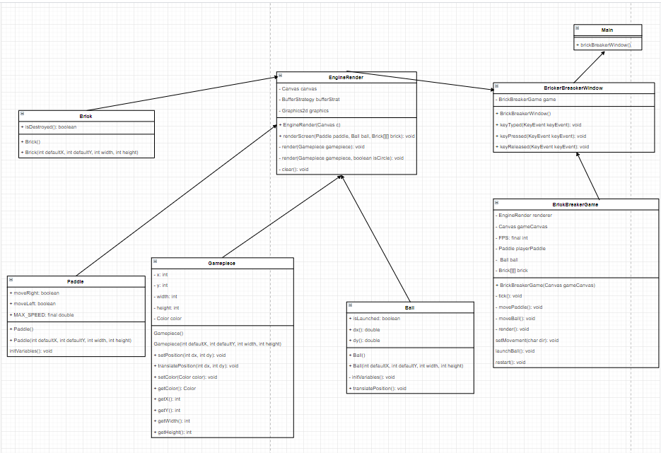

# Brick Breaker

The inspiration from this project came from traditional brick breaker games, which we wanted a challenge in creating a classic game. 

### UML



## Controls
- A and D move the paddle
- W launches the ball as well as slams it back toward the paddle
- R restarts the game
- ESC pauses and unpauses the game

## Getting Started

Follow these instructions to download a release version of this program and to learn how to install it.

### Prerequisites

Current versions work on all platforms.

<br>

You can download the Repository from [here](https://github.com/brick-breaker/brickBreaker/tree/chase-development)


### Installing

Follow these instructions to unpackage and install releases found on our [release page](https://github.com/CThompson01/christmas-eve-eve/releases).
[Latest Stable Release](https://github.com/CThompson01/christmas-eve-eve/releases/tag/v0.1.1-alpha)

<br>
After downloading open a terminal

```
On Linux this can typically be done by pressing ctrl+alt+t

```

Navigate to your download location. Typically in your downloads folder.

```
cd Downloads/
```

Now unpackage the tar file. 

If you have a different release version, replace the "0.1" with the correct version.

```

```

Now navigate to the unpackaged files.

Again if you have a different release version, replace the "0.1" with the correct version.

```

```

Run the configure file to configure the program to your system.
If your system is unable to run the program it will return an error message.

```
./configure
```

Now run these commands to finish installation. The second command may ask for your password in order to install properly

```
make
sudo make install
```

And it's installed! Now you can break bricks whenever you please.

## Authors

* **Chase Thompson** - *Main Developer* - [CThompson01](https://github.com/CThompson01)
* **Sam Olsen** - *Idea* - [Olsen031](https://github.com/Olsen031)


See also the list of [contributors](????) who participated in this project.

## License

This project is licensed under the GNU General Public License v3.0 - see the [LICENSE.md](LICENSE.md) file for details

## Acknowledgments

* Sam Olsen for the idea at 1:06 am on Friday, April 19, 2019
* Chase Thompson for figuring out the collisions of the bricks and much much more. 

